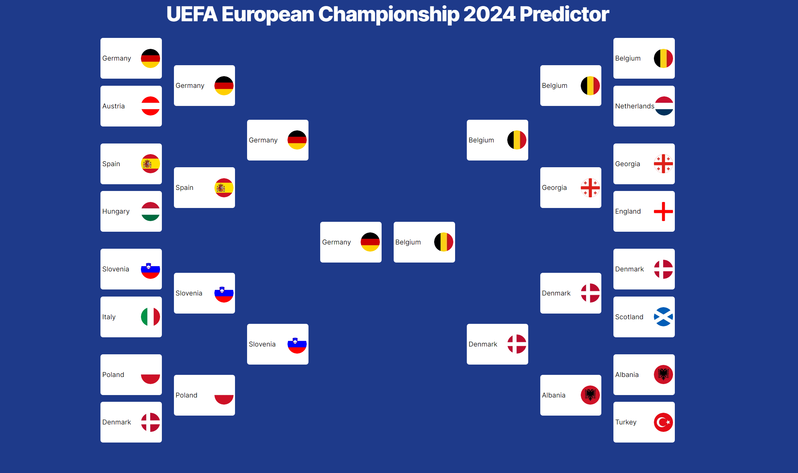

# UEFA 2024 Predictor (Frontend)



Hi! My name is Sri and this is my project to predict the UEFA 2024 Euros. As someone who tries to catch ever soccer match, this project seemed like the perfect combination of sports analystics and machine learning.

This repository contains the next app that pairs with the backend components on the other [repo](https://github.com/SriTree/UEFA_2024_Predictor_Backend).

## Demo
https://euro-predictor-nine.vercel.app/

## Getting Started

First, run the development server:

```bash
npm run dev
# or
yarn dev
# or
pnpm dev
# or
bun dev
```

Open [http://localhost:3000](http://localhost:3000) with your browser to see the result.

You can start editing the page by modifying `app/page.tsx`. The page auto-updates as you edit the file.

This project uses [`next/font`](https://nextjs.org/docs/basic-features/font-optimization) to automatically optimize and load Inter, a custom Google Font.

## Acknowledgements

 - [How to predict NFL Winners with Python](https://www.activestate.com/blog/how-to-predict-nfl-winners-with-python/)
 - [Predict Football Match Winners With Machine Learning And Python](How to predict NFL Winners with Python)

## Tech Stack

**Server:** NextJS, Flask, TailwindCSS
